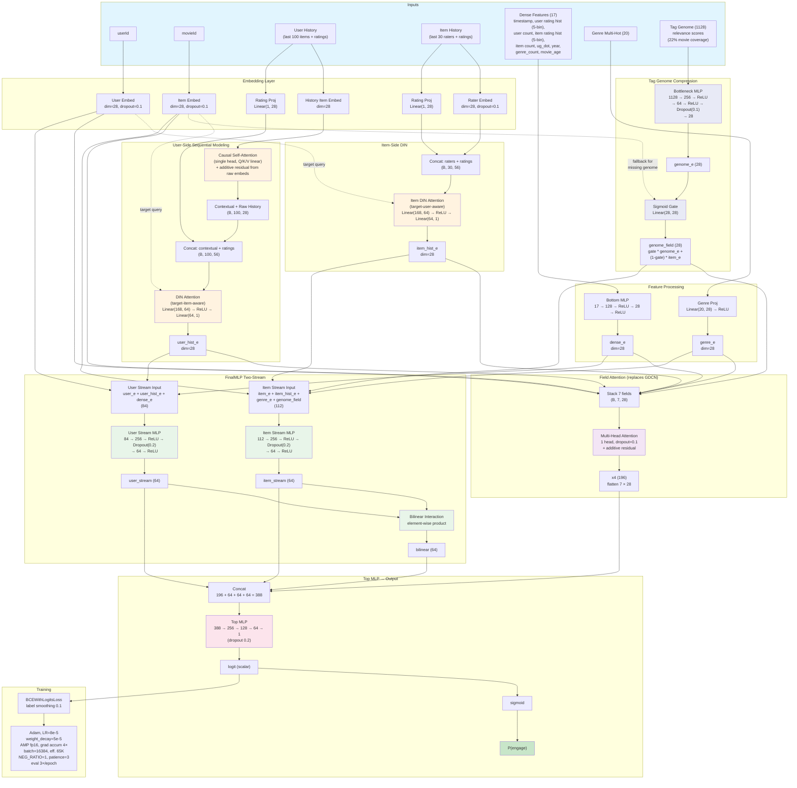

# Model Architecture

DLRM with rating-aware DIN + causal self-attention (with residual), item-side DIN, tag genome with learned bottleneck compression, 1-head field attention, FinalMLP two-stream with bilinear.

**Single model: val_auc = 0.821 on ml-25m** | ~13M params | ~7.6 GB VRAM on NVIDIA L4
**Ensemble (22 models): val_auc = 0.824 on ml-25m** | LogReg stacking of architecturally diverse variants
**~460 experiments total**

\* **History residual:** Causal self-attention output is added to raw item embeddings before DIN, preserving item identity alongside contextual representation.

\*\* **Tag genome gating:** 78% of movies lack genome data. The sigmoid gate learns to fall back to `item_e` when genome features are zeros. PCA compression failed (0.798); the learned 3-layer bottleneck MLP succeeds (0.811→0.814).

\*\*\* **Field attention replaces GDCN:** 1-head multi-head attention across 7 feature fields with additive residual. Simpler than 4 gated cross layers, slightly better AUC (0.8207 vs 0.8201).

## Ensemble

The best results come from ensembling architecturally diverse models. Key insight: models need **low prediction correlation** to provide complementary signal.

**Best ensemble: 0.8242 AUC** (LogReg stacking, 22 models, 5-fold CV)

Top ensemble members (by contribution):
- `fieldattn` (0.821) — current best single model
- `meanpool` (0.819) — no attention, mean pooling history (correlation 0.944)
- `ratingpool` (0.819) — rating-weighted mean pooling (correlation ~0.94)
- `noitemdin` (0.821) — no item-side DIN
- `nostream` (0.818) — no two-stream separation
- `dim16` (0.818) — embed_dim=16, much smaller model

Models with >0.97 prediction correlation with fieldattn (GDCN, nogenome) add little ensemble value. The most valuable partners are those with fundamentally different inductive biases.
