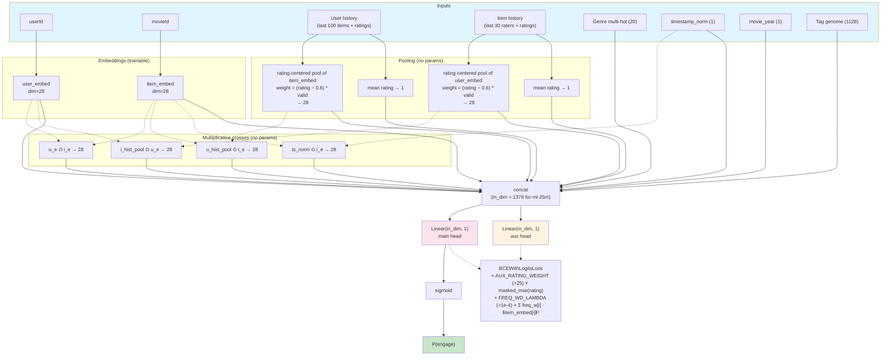

# MovieLens Recommendation — Restart (apr28)

Predict whether a user will rate a movie >= 4 stars (positive engagement). Hybrid task with hard negatives (rated < 4) and easy negatives (random unrated). Same data + same metric as the legacy project.

## Why a restart?

The legacy project (`legacy/`) reached **val_auc = 0.8284** on ml-25m after ~540 experiments converging on a DLRM-style architecture: per-field embeddings, causal self-attention + DIN over user history, item-side DIN, tag-genome bottleneck, squeeze-and-excitation field reweighting, and a 4-layer top MLP.

Two separate ceiling tests confirmed the architecture family is saturated:

- **apr27 (10 cycles, ~63 trials)** — every architectural addition (HSTU-style attention, multi-task aux loss, per-position genome similarity, field-pair bilinear) produced sub-noise lift or negative.
- **apr27c (15 trials with multi-seed verify)** — adding a multi-layer pre-LN transformer encoder over user history regressed across 5 seeds (mean lift -0.000487, 1/5 positive).

Apr27b's 100-trial HP sweep extracted +0.0017 from joint HP retuning, but that is the only direction that still moved the baseline. The legacy architecture is a local optimum.

This restart starts from the **simplest possible model — a single Linear head on concatenated features — with the same input features and prediction goals**, so future architectural choices can be motivated by clear ablations rather than 540 experiments of accumulated assumptions.

## Architecture (current baseline)



The "linear" naming refers to the prediction head — embeddings are still trainable (~6.1M params for ml-25m); the heads themselves are ~1.3K params each. Genre multi-hot, timestamp, year, and tag genome feed the head as-is, with no intermediate projection (a `Linear(20, 28) → Linear(in, 1)` chain is mathematically equivalent to a direct `Linear(20, 1)` slice in the head — the projection was redundant).

The auxiliary rating-residual head shares the same concat as the main head and predicts the per-sample normalized rating (0.5★→0.1, …, 5★→1.0). Random unrated easy negatives are masked out of the aux MSE. The combined loss `bce + 25·mse` shifts the embeddings toward representations that simultaneously rank engagement and predict rating magnitude — multi-task signal that the linear head turns into +0.0017 multi-seed lift.

Stripped to the bones: only raw IDs, raw history sequences, and pure content metadata (genres, tag genome, year, timestamp). All pre-computed user/item statistics — rating histograms, counts, user-genre affinity, user genome profile — are out, on the principle that aggregations are relationships the model should learn from raw data, not inputs hand-specified before training.

## Layout

- **`prepare.py`** — Shared with legacy. Data download + time-based train/val/test splits + AUC evaluation. Do not modify (the evaluation harness is the ground truth metric).
- **`train.py`** — The current model. Linear head over a 1376-dim concat of embeddings + 4 multiplicative crosses + raw content features; auxiliary rating-residual regression head sharing the same concat. No hidden layers in the heads.
- **`program.md`** — Experiment log of the restart cycles (apr28b through apr28x so far).
- **`legacy/`** — Frozen archive of the prior project. Available for reference; not authoritative for the restart.

## Quickstart

```bash
# Smoke test (ml-100k, ~seconds, crash detection only)
DATASET=ml-100k uv run python train.py

# Standard experiment (ml-25m)
DATASET=ml-25m uv run python train.py
```

## What gets carried over from legacy

- The data pipeline (`prepare.py:load_data_hybrid`)
- The feature engineering (genre multi-hot, rating histograms, user/item histories, tag genome, user genome profile, dense features)
- The HP defaults that were multi-seed-verified to help (`NEG_RATIO=1`, `train_neg_mode=anchor_pos_catalog`)
- The 16 critical learnings in `legacy/CLAUDE.md` — especially #14 (seed variance ≈ 0.00078) and #15 (sub-noise single-knob lifts can stack)

## What does NOT get carried over

- The model architecture (causal SA, DIN, field attention, two-stream MLPs, top MLP)
- The 16 architectural-cycle's worth of dropouts, gates, residuals, and conditional flags
- Anything in `legacy/train.py` past the feature-engineering section

Current baseline AUC: **0.8282 on ml-25m** (deterministic, SEED=42; 5-seed mean +0.00175 over the prior 0.8263 LR/WD-retuned baseline). Reached by stacking three individually sub-threshold mechanisms — each +0.0005 to +0.0007 single-seed alone, but +0.0017 multi-seed when combined (super-additive).

Four wins so far on the restart, all pure aggregator/feature/HP changes (no big architectural shifts):
- **Centered pool** (0.8246 from 0.8219): switched user-history and item-history pools from plain mean to a rating-centered weighted pool. Items rated above 3 stars push *toward* their embedding; items below 3 stars push *away*. Sign matters.
- **Cross fields** (0.8251 from 0.8246): appended three Hadamard products to the concat — `u_e ⊙ i_e`, `u_hist_pool ⊙ i_e`, `i_hist_pool ⊙ u_e`. The linear head literally cannot synthesize multiplicative interactions on its own.
- **LR + WD retune** (0.8263 from 0.8251): `LR=3e-4`, `WD=5e-5`. The new richer-feature baseline benefits from a softer, more regularized optimizer.
- **Sub-noise stack** (0.8282 from 0.8263): three orthogonal mechanisms, each individually below the multi-seed bar, compound super-additively:
  - `CROSS_TS_ITEM=1`: 4th cross field `ts_norm ⊙ i_e` for temporal drift in item preference
  - `FREQ_WD_LAMBDA=1e-4`: per-item L2 weighted by `1/sqrt(count + 5)` — tail items get more regularization
  - `AUX_RATING_WEIGHT=25.0`: parallel Linear head predicting normalized rating, MSE multi-task loss

This brings the linear-head baseline to within 0.0002 of the legacy DLRM ceiling (0.8284) — same task, much simpler architecture (no DIN, no field attention, no genome bottleneck, no two-stream MLPs).
