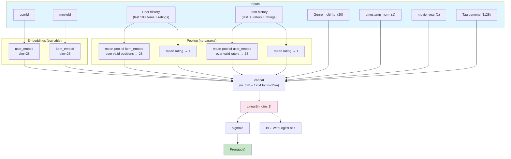

# MovieLens Recommendation — Restart (apr28)

Predict whether a user will rate a movie >= 4 stars (positive engagement). Hybrid task with hard negatives (rated < 4) and easy negatives (random unrated). Same data + same metric as the legacy project.

## Why a restart?

The legacy project (`legacy/`) reached **val_auc = 0.8284** on ml-25m after ~540 experiments converging on a DLRM-style architecture: per-field embeddings, causal self-attention + DIN over user history, item-side DIN, tag-genome bottleneck, squeeze-and-excitation field reweighting, and a 4-layer top MLP.

Two separate ceiling tests confirmed the architecture family is saturated:

- **apr27 (10 cycles, ~63 trials)** — every architectural addition (HSTU-style attention, multi-task aux loss, per-position genome similarity, field-pair bilinear) produced sub-noise lift or negative.
- **apr27c (15 trials with multi-seed verify)** — adding a multi-layer pre-LN transformer encoder over user history regressed across 5 seeds (mean lift -0.000487, 1/5 positive).

Apr27b's 100-trial HP sweep extracted +0.0017 from joint HP retuning, but that is the only direction that still moved the baseline. The legacy architecture is a local optimum.

This restart starts from the **simplest possible model — a single Linear head on concatenated features — with the same input features and prediction goals**, so future architectural choices can be motivated by clear ablations rather than 540 experiments of accumulated assumptions.

## Architecture (current baseline)



The "linear" naming refers to the prediction head — embeddings are still trainable (~6.1M params for ml-25m); the head itself is ~1.3K params. Genre multi-hot, timestamp, year, and tag genome feed the head as-is, with no intermediate projection (a `Linear(20, 28) → Linear(in, 1)` chain is mathematically equivalent to a direct `Linear(20, 1)` slice in the head — the projection was redundant).

Stripped to the bones: only raw IDs, raw history sequences, and pure content metadata (genres, tag genome, year, timestamp). All pre-computed user/item statistics — rating histograms, counts, user-genre affinity, user genome profile — are out, on the principle that aggregations are relationships the model should learn from raw data, not inputs hand-specified before training.

## Layout

- **`prepare.py`** — Shared with legacy. Data download + time-based train/val/test splits + AUC evaluation. Do not modify (the evaluation harness is the ground truth metric).
- **`train.py`** — The new linear baseline. Same input features as legacy (sparse IDs, user history, item history, genre multi-hot, dense numeric features, tag genome, per-user genome profile), but the model is `concat → Linear(in, 1) → sigmoid`. No hidden layer.
- **`program.md`** — Fresh experiment log. The new autoresearch loop starts here.
- **`legacy/`** — Everything from the old project, frozen. `legacy/program.md` has the full ~540-experiment history. `legacy/CLAUDE.md` has the 16 critical learnings from that body of work — read those before proposing new architectures.

## Quickstart

```bash
# Smoke test (ml-100k, ~seconds, crash detection only)
DATASET=ml-100k uv run python train.py

# Standard experiment (ml-25m)
DATASET=ml-25m uv run python train.py
```

## What gets carried over from legacy

- The data pipeline (`prepare.py:load_data_hybrid`)
- The feature engineering (genre multi-hot, rating histograms, user/item histories, tag genome, user genome profile, dense features)
- The HP defaults that were multi-seed-verified to help (`NEG_RATIO=1`, `train_neg_mode=anchor_pos_catalog`)
- The 16 critical learnings in `legacy/CLAUDE.md` — especially #14 (seed variance ≈ 0.00078) and #15 (sub-noise single-knob lifts can stack)

## What does NOT get carried over

- The model architecture (causal SA, DIN, field attention, two-stream MLPs, top MLP)
- The 16 architectural-cycle's worth of dropouts, gates, residuals, and conditional flags
- Anything in `legacy/train.py` past the feature-engineering section

Stripped baseline AUC: **0.8219 on ml-25m** (deterministic, SEED=42). Surprisingly close to the legacy 0.8284 ceiling without any of its machinery — and notably higher than the same linear head with all of legacy's pre-computed user/item statistics fed in (0.7848). The pre-computed aggregations were diluting signal, not adding it.
