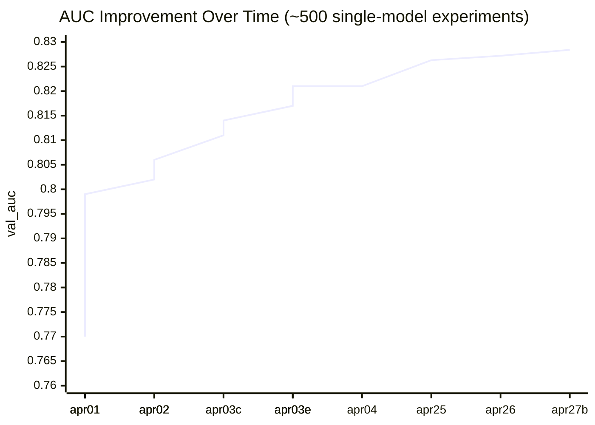
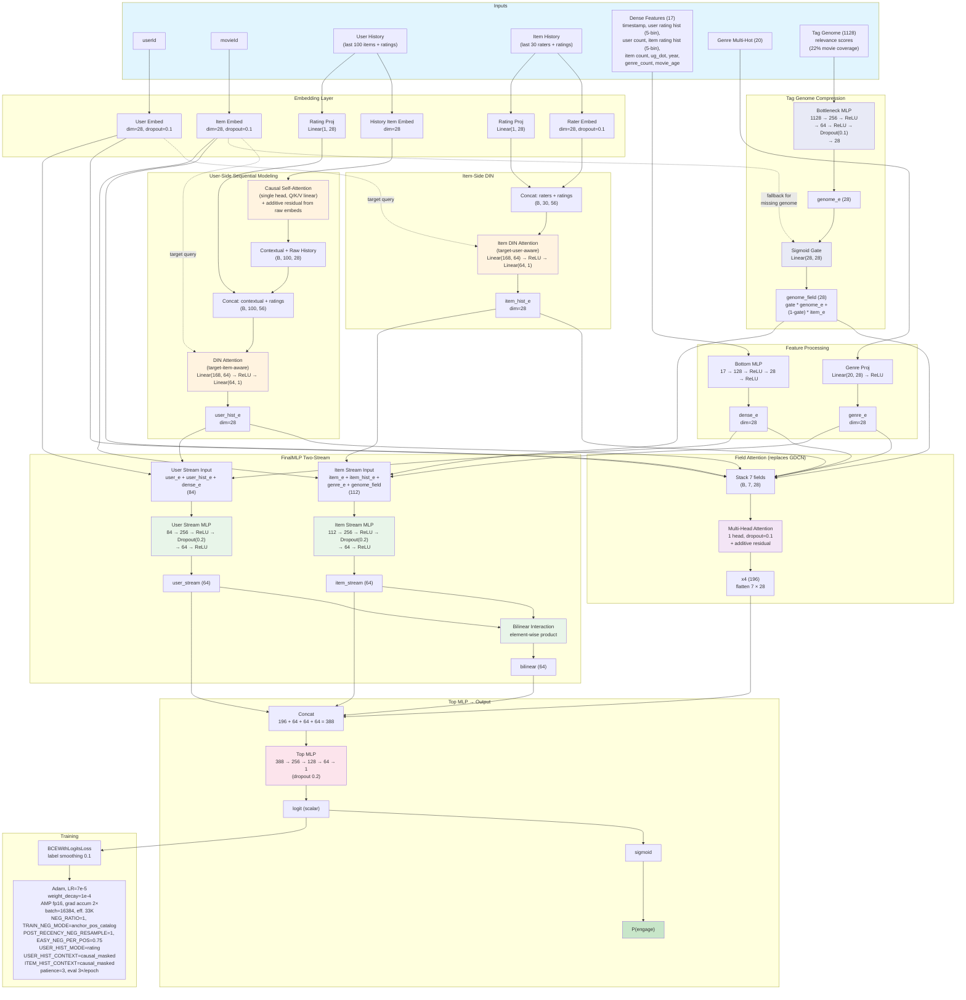

# MovieLens Recommendation — Hybrid Engagement Prediction

Predict whether a user will rate a movie >= 4 stars (positive engagement). Hybrid task with hard negatives (rated < 4) and easy negatives (random unrated). ~500 experiments on ml-25m.

**Current restart baseline: val_auc = 0.8284 at SEED=42 on ml-25m (apr27b 100-trial HP sweep, +0.0012 over apr26 cycle-8)**
**Best historical single model: val_auc = 0.821 (apr04 architecture summarized below)**
**Best historical ensemble: val_auc = 0.854 (HistGBM stacking of 59 diverse models, 3-fold CV)**

The checked-in `train.py` is the restart baseline (squeeze-and-excitation field reweighting + scalar-dot user-genome alignment) and differs from the apr04 best historical single-model architecture summarized below. Treat the code as the source of truth for the current implementation, and this README as a summary of historical results.

## AUC Progress

### Key milestones

| Date | AUC | Experiments | What worked |
|------|-----|------------|-------------|
| Apr 1 | 0.770 | 0 | Baseline DLRM on ml-25m |
| Apr 1 | 0.799 | ~30 | HISTORY_LEN=100, 3 GDCN layers, causal self-attention |
| Apr 2 | 0.806 | ~120 | Rating histograms, 4 GDCN layers, embed_dim=28 |
| Apr 3 | 0.814 | ~170 | Tag genome with learned bottleneck compression |
| Apr 4 | 0.821 | ~250 | NEG_RATIO=1, WD=5e-5, ACCUM=4, LR=8e-5 (historical FinalMLP two-stream) |
| Apr 25 | 0.8263 | ~430 | Restart on SE field-reweighting baseline: anchor-pos-catalog negatives + post-recency neg resample + rating-pooled causal histories |
| Apr 26 | 0.8272 | ~440 | Per-user genome profile + scalar-dot user×item content alignment routed into `genome_field` (cycle-8 win, +0.000944 over 0.82628) |
| **Apr 27b** | **0.8284** | **~540** | **100-trial HP sweep stacking 4 sub-noise single-knob lifts: `RECENCY_FRAC=0.7`, `POST_RECENCY_EASY_NEG_PER_POS=0.4`, `GENOME_BOTTLENECK_DROPOUT=0.0`, `MLP_DROPOUT=0.3` — 5-seed mean lift +0.00170 (5/5 positive)** |

## Best Historical Single-Model Architecture

This section describes the best historical single-model variant from the Apr 4-5 experiments, not necessarily the exact checked-in `train.py`.

\* **History residual:** Causal self-attention output is added to raw item embeddings before DIN, preserving item identity alongside contextual representation.

\*\* **Tag genome gating:** 78% of movies lack genome data. The sigmoid gate learns to fall back to `item_e` when genome features are zeros. PCA compression failed (0.798); the learned 3-layer bottleneck MLP succeeds (0.811→0.814).

\*\*\* **Field attention replaces GDCN:** 1-head multi-head attention across 7 feature fields with additive residual. Simpler than 4 gated cross layers, slightly better AUC (0.8207 vs 0.8201).
