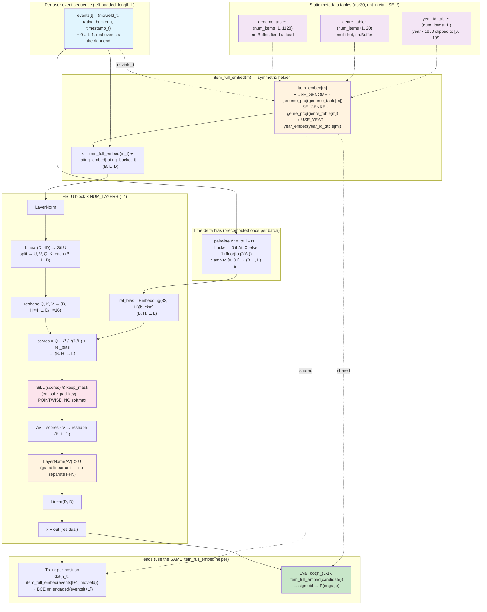

# MovieLens — HSTU generative recommendation

Predict whether a user will rate a movie ≥ 4 stars (positive engagement). Same task and metric as the prior attempts — different model: **HSTU** (Hierarchical Sequential Transduction Units, Meta 2024 — *Actions Speak Louder than Words*).

## Why HSTU, why a fresh start?

Two prior attempts on this task are archived in `legacy/` and `simple_v2/`:

- `legacy/` — DLRM-style architecture (causal SA + DIN + tag-genome bottleneck + 4-layer MLP). Reached **val 0.8284** on ml-25m after ~540 experiments. Architecture family confirmed saturated by two ceiling tests (apr27, apr27c).
- `simple_v2/` — apr28 restart from a single Linear head over engineered features (rating-centered history pools, multi-hot genres, raw tag genome, manual cross fields, eval-time dynamic user history). Reached **val 0.8594 / test 0.8455** with ~6M params. Confirmed locked at apr28ah after 5 consecutive nulls — the engineered-feature representation has no remaining lift.

This attempt drops the "engineered features going into a scoring head" framing entirely. **HSTU treats the user as a token stream** of (item, action, time) events and uses pointwise causal attention to predict the next event's engagement target. No hand-specified history pools, no tag-genome concat, no cross fields. The model sees raw events; representations emerge from the sequence.

## Why HSTU specifically (not OneRec / PinRec / TIGER)

- **HSTU** is point-estimate scoring (per-event probability) — keeps AUC eval apples-to-apples vs simple_v2 / legacy.
- **OneRec / PinRec** are encoder-decoder generative *retrieval* (beam-search a ranked slate) — closer to "true generative" but force NDCG@K and are 2-3× the code.
- **TIGER** sits between the two, with semantic-ID quantization. Higher cold-start ceiling than HSTU but bigger build (RQ-VAE + encoder-decoder + decoding) and a metric change.

HSTU is the cleanest first generative baseline that lets us measure against the apr28ah locked number directly. If HSTU lifts meaningfully, we can layer semantic-ID quantization on top later.

## Layout

- **`prepare.py`** — Shared with both prior attempts. Data download + time-based train/val/test splits + `evaluate()` AUC harness. **Do not modify.**
- **`train.py`** — HSTU model + sequence data pipeline + training loop. Content metadata, MLP head, bf16, interleaving, LR schedules, aux rating head — all flag-gated, default OFF.
- **`program.md`** — Experiment log for this attempt (apr30 cycle complete).
- **`legacy/`** — Frozen archive of the original DLRM project.
- **`simple_v2/`** — Frozen archive of the apr28 linear-head restart. The locked baseline (`val 0.859384`, `test 0.845497`) lives there for comparison.
- **`data/`** — Auto-downloaded MovieLens datasets; not in git.

## Quickstart

```bash
uv sync

# Smoke test (ml-100k, ~seconds)
DATASET=ml-100k uv run python train.py

# Standard experiment (ml-25m on the current CUDA GPU)
DATASET=ml-25m uv run python train.py
```

## Architecture


```mermaid
graph TD
    subgraph "Per-user event sequence (left-padded, length L)"
        EV["events[t] = (movieId_t, rating_bucket_t, timestamp_t)<br/>t = 0 .. L-1, real events at the right end"]
    end

    subgraph "Static metadata tables (apr30, opt-in via USE_*)"
        GMT["genome_table: (num_items+1, 1128)<br/>nn.Buffer, fixed at load"]
        GRT["genre_table: (num_items+1, 20)<br/>multi-hot, nn.Buffer"]
        YRT["year_id_table: (num_items+1,)<br/>year - 1850 clipped to [0, 199]"]
    end

    subgraph "item_full_embed(m) — symmetric helper"
        EV -.->|"movieId_t"| IFE["item_embed[m]<br/>+ USE_GENOME · genome_proj(genome_table[m])<br/>+ USE_GENRE · genre_proj(genre_table[m])<br/>+ USE_YEAR · year_embed(year_id_table[m])"]
        GMT -.-> IFE
        GRT -.-> IFE
        YRT -.-> IFE
        IFE --> IE["x = item_full_embed(m_t) + rating_embed[rating_bucket_t]<br/>→ (B, L, D)"]
        EV --> IE
    end

    subgraph "Time-delta bias (precomputed once per batch)"
        EV --> TD["pairwise Δt = |ts_i - ts_j|<br/>bucket = 0 if Δt=0, else 1+floor(log2(Δt))<br/>clamp to [0, 31] → (B, L, L) int"]
    end

    subgraph "HSTU block × NUM_LAYERS (=4)"
        IE --> LN1["LayerNorm"]
        LN1 --> UVQK["Linear(D, 4D) → SiLU<br/>split → U, V, Q, K  each (B, L, D)"]
        UVQK --> MH["reshape Q, K, V → (B, H=4, L, D/H=16)"]
        TD --> RB["rel_bias = Embedding(32, H)[bucket]<br/>→ (B, H, L, L)"]
        MH --> SCORE["scores = Q · Kᵀ / √(D/H) + rel_bias<br/>→ (B, H, L, L)"]
        RB --> SCORE
        SCORE --> POINT["SiLU(scores) ⊙ keep_mask<br/>(causal × pad-key) — POINTWISE, NO softmax"]
        POINT --> AV["AV = scores · V → reshape (B, L, D)"]
        AV --> GLU["LayerNorm(AV) ⊙ U<br/>(gated linear unit — no separate FFN)"]
        GLU --> WO["Linear(D, D)"]
        WO --> RES["x + out (residual)"]
    end

    subgraph "Heads (use the SAME item_full_embed helper)"
        RES --> TRH["Train: per-position<br/>dot(h_t, item_full_embed(events[t+1].movieId))<br/>→ BCE on engaged(events[t+1])"]
        RES --> EVH["Eval: dot(h_{L-1}, item_full_embed(candidate))<br/>→ sigmoid → P(engage)"]
        IFE -.->|"shared"| TRH
        IFE -.->|"shared"| EVH
    end

    style EV fill:#e1f5fe
    style IFE fill:#fff3e0
    style POINT fill:#fce4ec
    style GLU fill:#fff3e0
    style EVH fill:#c8e6c9
    style GMT fill:#f3e5f5
    style GRT fill:#f3e5f5
    style YRT fill:#f3e5f5
```

The signature HSTU departures from a vanilla causal transformer:

- **Pointwise (SiLU) attention, not softmax.** No row-wise normalization over keys.
- **Gated linear unit replaces FFN.** `LayerNorm(AV) ⊙ U` does both attention output and channel-mixing in one step.
- **Relative-position bias from log-bucketed time deltas.** Per-block, per-head learnable bias table over 32 time-gap buckets (0 = same instant, 31 = >2³⁰ s ≈ 34 yr). Init zeros so the model starts as a no-bias HSTU.

Per Meta 2024 §3.

### Content metadata injection (apr30, Idea 1)

Three opt-in flags wire MovieLens content into HSTU:

- `USE_GENOME=1` — MovieLens 1128-d tag-genome (relevance scores per tag-id, dense)
- `USE_GENRE=1` — 20-d genre multi-hot from `movies.csv`
- `USE_YEAR=1` — year embedding via title regex `(\d{4})`, bucketed `clip(year - 1850, 0, 199)`

Single symmetric helper `item_full_embed(m)` adds projected metadata to `item_embed[m]`. The same helper is used at three call sites:

1. **Sequence input** — every position's input is `item_full_embed(m_t) + rating_embed(r_t)`
2. **Per-position training target** — `dot(h_t, item_full_embed(events[t+1].movieId))` (no rating, since rating is the label)
3. **Eval candidate scoring** — `dot(h_{L-1}, item_full_embed(candidate))`

Whatever metadata-fused embedding the sequence sees as observations is exactly what the candidate gets at scoring time — symmetric by design, no separate "head augmentation" branch.

**Off-state byte-equivalence**: when all three flags are 0, the projection modules (`genome_proj`, `genre_proj`, `year_embed`) are not constructed at all (RNG state preserved). At ON state, projection weights are zero-init so step-0 logits match OFF; signal grows monotonically as projections train.

**Tables stored as `nn.Buffer(persistent=False)`**: 254 MB on GPU at ml-25m for the genome table; not in `state_dict` (rebuilt at load).

## Status

`apr30` cycle complete. Cumulative progression on ml-25m at SEED=42:

| stage | val_auc | commit | mechanism |
|---|---|---|---|
| Pure HSTU 4L/64D LR=5e-3 | 0.8367 | `a046154` | sequence-level + Bug #1 fix |
| Capacity sweep (A/B) | flat | `2bf0713` | width axis not binding |
| Metadata (M1) | 0.8453 (peak) | `ab4bdda` | genome+genre+year, training spikes at LR=5e-3 |
| Stabilization (S2) | 0.8467 | `a768f4d` | clip 1.0 + xavier init, cures spikes |
| Cycle 2 LR=2e-3 | 0.8541 | `8368ebb` | LR halved, monotone climb |
| C1 LR=1e-3 | 0.8547 | `a727e97` | LR step further (sub-σ) |
| C2 MLP head | 0.8561 | `a95cbc9` | MLP on h_t (sub-σ) |
| LR schedule + AdamW infra | (off-state) | `1edb678` | flag-gated; cosine + AdamW available |
| L3_bf16 | 0.8560 | `7e8ae4d` | NUM_LAYERS=3 + bf16, **27% faster** |
| **interleave_3L_bf16** | **0.8567** (s42) / **0.8558** (s43), 2-seed mean **0.8563** | `2bf0713` | paper-canonical interleaved tokens |
| L2_bf16 | 0.8546 | (same sweep) | depth=2 too aggressive |
| aux+interleave | 0.8556 | `db899f7` | AUX=25 mechanism doesn't transfer to HSTU |

**Operational best**: `interleave_3L_bf16` config — `INTERLEAVE=1 SEQ_LEN=100 NUM_LAYERS=3 USE_BF16=1 LR=1e-3 GRAD_CLIP=1.0 PROJ_INIT_MODE=xavier USE_GENOME+GENRE+YEAR=1 MLP_HEAD=1 MLP_HEAD_DROPOUT=0.1`. ~120 min/cell on ml-25m.

**Gap to simple_v2 0.8594**: −0.0027 single-seed / −0.0031 2-seed mean. Multi-seed +0.005 lift threshold not yet cleared, so test-set evaluation not yet authorized.

**Key findings**:
- Pure HSTU at 0.8367 already beats heavily-tuned simple_v2 static (0.828) and legacy DLRM (0.8284) with NO movie content features — pure user-item interaction modeling carries the signal.
- Content metadata (genome/genre/year) lifts +0.008 — closes part of the gap to simple_v2.
- Stabilization (clip + xavier + LR=1e-3) is necessary to preserve the lift over a stable training run.
- MLP head on h_t adds +0.001 (sub-σ).
- NUM_LAYERS=3 + bf16 is the right operational baseline (27% faster, no AUC cost).
- Interleaving (paper-canonical Meta 2024 §3) lifts +0.0007 over fused-token (sub-σ but consistent positive).
- AUX_RATING_WEIGHT=25 (simple_v2 mechanism) does NOT transfer to HSTU — the rating_embed already encodes rating info, making aux MSE redundant.

The architecture diagram above shows fused-token mode (current `train.py` default with `INTERLEAVE=0`); the operational best uses `INTERLEAVE=1` for the paper-canonical [c_0, a_0, c_1, a_1, ...] sequence.

## What carries over from the prior attempts

- `prepare.py` data pipeline + `evaluate()` AUC harness (the metric is the ground truth)
- The label scheme: rating ≥ 4 → positive (1); rating < 4 OR random unrated → negative (0)
- The dataset choice: ml-25m as the default; ml-100k for smoke tests
- The discipline learnings (multi-seed verification, deterministic SEED=42, etc.) — see `legacy/CLAUDE.md` learnings #14, #15

## What does NOT carry over

- Any model architecture or layer choices
- Any feature engineering (history pools, multi-hot fields, tag genome, cross products, eval-time dynamic-history mechanism)
- Any hyperparameter defaults — HSTU has its own (embed dim, num layers, num heads, sequence length)
- Any inherited assumption about input structure
