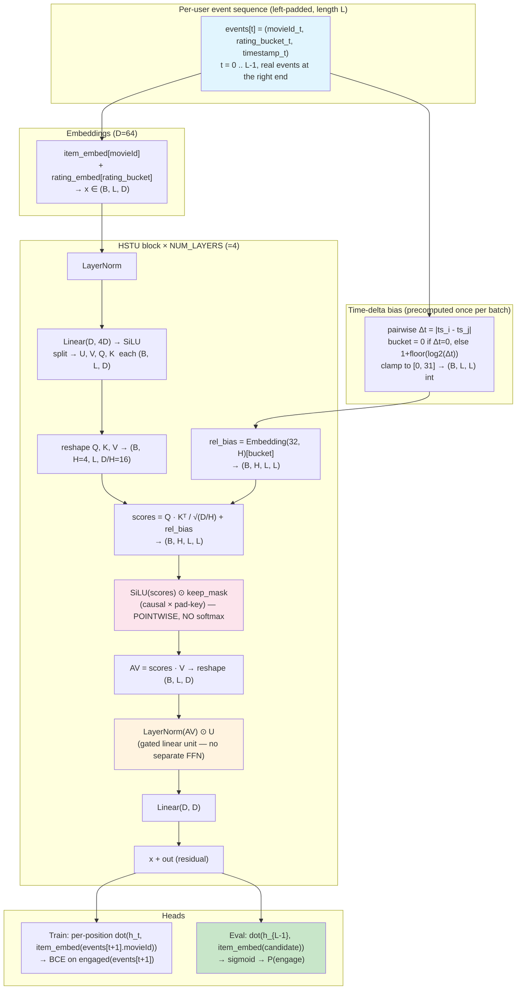

# MovieLens — HSTU generative recommendation

Predict whether a user will rate a movie ≥ 4 stars (positive engagement). Same task and metric as the prior attempts — different model: **HSTU** (Hierarchical Sequential Transduction Units, Meta 2024 — *Actions Speak Louder than Words*).

## Why HSTU, why a fresh start?

Two prior attempts on this task are archived in `legacy/` and `simple_v2/`:

- `legacy/` — DLRM-style architecture (causal SA + DIN + tag-genome bottleneck + 4-layer MLP). Reached **val 0.8284** on ml-25m after ~540 experiments. Architecture family confirmed saturated by two ceiling tests (apr27, apr27c).
- `simple_v2/` — apr28 restart from a single Linear head over engineered features (rating-centered history pools, multi-hot genres, raw tag genome, manual cross fields, eval-time dynamic user history). Reached **val 0.8594 / test 0.8455** with ~6M params. Confirmed locked at apr28ah after 5 consecutive nulls — the engineered-feature representation has no remaining lift.

This attempt drops the "engineered features going into a scoring head" framing entirely. **HSTU treats the user as a token stream** of (item, action, time) events and uses pointwise causal attention to predict the next event's engagement target. No hand-specified history pools, no tag-genome concat, no cross fields. The model sees raw events; representations emerge from the sequence.

## Why HSTU specifically (not OneRec / PinRec / TIGER)

- **HSTU** is point-estimate scoring (per-event probability) — keeps AUC eval apples-to-apples vs simple_v2 / legacy.
- **OneRec / PinRec** are encoder-decoder generative *retrieval* (beam-search a ranked slate) — closer to "true generative" but force NDCG@K and are 2-3× the code.
- **TIGER** sits between the two, with semantic-ID quantization. Higher cold-start ceiling than HSTU but bigger build (RQ-VAE + encoder-decoder + decoding) and a metric change.

HSTU is the cleanest first generative baseline that lets us measure against the apr28ah locked number directly. If HSTU lifts meaningfully, we can layer semantic-ID quantization on top later.

## Layout

- **`prepare.py`** — Shared with both prior attempts. Data download + time-based train/val/test splits + `evaluate()` AUC harness. **Do not modify.**
- **`train.py`** — HSTU model + training loop. Currently a stub.
- **`program.md`** — Experiment log for this attempt (starts empty).
- **`legacy/`** — Frozen archive of the original DLRM project.
- **`simple_v2/`** — Frozen archive of the apr28 linear-head restart. The locked baseline (`val 0.859384`, `test 0.845497`) lives there for comparison.
- **`data/`** — Auto-downloaded MovieLens datasets; not in git.

## Quickstart

```bash
uv sync

# Smoke test (ml-100k, ~seconds)
DATASET=ml-100k uv run python train.py

# Standard experiment (ml-25m on the current CUDA GPU)
DATASET=ml-25m uv run python train.py
```

## Architecture


```mermaid
graph TD
    subgraph "Per-user event sequence (left-padded, length L)"
        EV["events[t] = (movieId_t, rating_bucket_t, timestamp_t)<br/>t = 0 .. L-1, real events at the right end"]
    end

    subgraph "Embeddings (D=64)"
        EV --> IE["item_embed[movieId]<br/>+ rating_embed[rating_bucket]<br/>→ x ∈ (B, L, D)"]
    end

    subgraph "Time-delta bias (precomputed once per batch)"
        EV --> TD["pairwise Δt = |ts_i - ts_j|<br/>bucket = 0 if Δt=0, else 1+floor(log2(Δt))<br/>clamp to [0, 31] → (B, L, L) int"]
    end

    subgraph "HSTU block × NUM_LAYERS (=4)"
        IE --> LN1["LayerNorm"]
        LN1 --> UVQK["Linear(D, 4D) → SiLU<br/>split → U, V, Q, K  each (B, L, D)"]
        UVQK --> MH["reshape Q, K, V → (B, H=4, L, D/H=16)"]
        TD --> RB["rel_bias = Embedding(32, H)[bucket]<br/>→ (B, H, L, L)"]
        MH --> SCORE["scores = Q · Kᵀ / √(D/H) + rel_bias<br/>→ (B, H, L, L)"]
        RB --> SCORE
        SCORE --> POINT["SiLU(scores) ⊙ keep_mask<br/>(causal × pad-key) — POINTWISE, NO softmax"]
        POINT --> AV["AV = scores · V → reshape (B, L, D)"]
        AV --> GLU["LayerNorm(AV) ⊙ U<br/>(gated linear unit — no separate FFN)"]
        GLU --> WO["Linear(D, D)"]
        WO --> RES["x + out (residual)"]
    end

    subgraph "Heads"
        RES --> TRH["Train: per-position dot(h_t, item_embed(events[t+1].movieId))<br/>→ BCE on engaged(events[t+1])"]
        RES --> EVH["Eval: dot(h_{L-1}, item_embed(candidate))<br/>→ sigmoid → P(engage)"]
    end

    style EV fill:#e1f5fe
    style POINT fill:#fce4ec
    style GLU fill:#fff3e0
    style EVH fill:#c8e6c9
```

The signature HSTU departures from a vanilla causal transformer:

- **Pointwise (SiLU) attention, not softmax.** No row-wise normalization over keys.
- **Gated linear unit replaces FFN.** `LayerNorm(AV) ⊙ U` does both attention output and channel-mixing in one step.
- **Relative-position bias from log-bucketed time deltas.** Per-block, per-head learnable bias table over 32 time-gap buckets (0 = same instant, 31 = >2³⁰ s ≈ 34 yr). Init zeros so the model starts as a no-bias HSTU.

Per Meta 2024 §3.

## Status

`apr30` branch implements the full pipeline:
- **Step 1** (`5bf86c6`): sequence-level training with per-position causal loss (SASRec/HSTU framing).
- **Step 2** (`e057e70`): real HSTU block — pointwise SiLU attention + gated linear unit + log-bucketed time-delta bias.
- **Bugfix** (after Validator audit): cold/short-history users were getting the wrong hidden state at eval (left-padding makes `seq_len-1` always the last real event, not `mask.sum()-1`). Now corrected.

Smoke test on ml-100k passes (val_auc ≈ 0.515 after 1 epoch — ml-100k is too small for the HSTU inductive bias to surface; ml-25m sweep is the real test).

## What carries over from the prior attempts

- `prepare.py` data pipeline + `evaluate()` AUC harness (the metric is the ground truth)
- The label scheme: rating ≥ 4 → positive (1); rating < 4 OR random unrated → negative (0)
- The dataset choice: ml-25m as the default; ml-100k for smoke tests
- The discipline learnings (multi-seed verification, deterministic SEED=42, etc.) — see `legacy/CLAUDE.md` learnings #14, #15

## What does NOT carry over

- Any model architecture or layer choices
- Any feature engineering (history pools, multi-hot fields, tag genome, cross products, eval-time dynamic-history mechanism)
- Any hyperparameter defaults — HSTU has its own (embed dim, num layers, num heads, sequence length)
- Any inherited assumption about input structure
