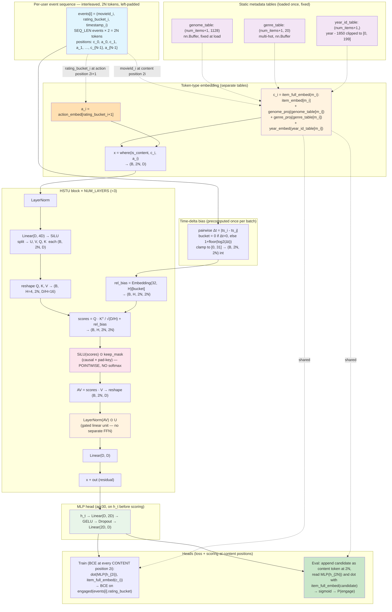

# MovieLens — HSTU generative recommendation

Predict whether a user will rate a movie ≥ 4 stars (positive engagement). Same task and metric as the prior attempts — different model: **HSTU** (Hierarchical Sequential Transduction Units, Meta 2024 — *Actions Speak Louder than Words*).

## Why HSTU, why a fresh start?

Two prior attempts on this task are archived in `legacy/` and `simple_v2/`:

- `legacy/` — DLRM-style architecture (causal SA + DIN + tag-genome bottleneck + 4-layer MLP). Reached **val 0.8284** on ml-25m after ~540 experiments. Architecture family confirmed saturated by two ceiling tests (apr27, apr27c).
- `simple_v2/` — apr28 restart from a single Linear head over engineered features (rating-centered history pools, multi-hot genres, raw tag genome, manual cross fields, eval-time dynamic user history). Reached **val 0.8594 / test 0.8455** with ~6M params. Confirmed locked at apr28ah after 5 consecutive nulls — the engineered-feature representation has no remaining lift.

This attempt drops the "engineered features going into a scoring head" framing entirely. **HSTU treats the user as a token stream** of (item, action, time) events and uses pointwise causal attention to predict the next event's engagement target. No hand-specified history pools, no tag-genome concat, no cross fields. The model sees raw events; representations emerge from the sequence.

## Why HSTU specifically (not OneRec / PinRec / TIGER)

- **HSTU** is point-estimate scoring (per-event probability) — keeps AUC eval apples-to-apples vs simple_v2 / legacy.
- **OneRec / PinRec** are encoder-decoder generative *retrieval* (beam-search a ranked slate) — closer to "true generative" but force NDCG@K and are 2-3× the code.
- **TIGER** sits between the two, with semantic-ID quantization. Higher cold-start ceiling than HSTU but bigger build (RQ-VAE + encoder-decoder + decoding) and a metric change.

HSTU is the cleanest first generative baseline that lets us measure against the apr28ah locked number directly. If HSTU lifts meaningfully, we can layer semantic-ID quantization on top later.

## Layout

- **`prepare.py`** — Shared with both prior attempts. Data download + time-based train/val/test splits + `evaluate()` AUC harness. **Do not modify.**
- **`train.py`** — HSTU model + sequence data pipeline + training loop. Content metadata, MLP head, bf16, interleaving, LR schedules, aux rating head, held-out test eval — all env-flag-gated. Operational-best flags are ON by default; experimental probes (USE_POP_PRIOR, USE_RATING_TS, USE_ITEM_STATS, USE_RATER_POOL, AUX_RATING_WEIGHT, RUN_TEST) default OFF.
- **`program.md`** — Experiment log for this attempt (may05 result: HSTU sliding-window beats simple_v2 by +0.0032 val and +0.0197 test).
- **`legacy/`** — Frozen archive of the original DLRM project.
- **`simple_v2/`** — Frozen archive of the apr28 linear-head restart. The locked baseline (`val 0.859384`, `test 0.845497`) lives there for comparison.
- **`data/`** — Auto-downloaded MovieLens datasets; not in git.

## Quickstart

```bash
uv sync

# Smoke test (ml-100k, ~seconds)
DATASET=ml-100k uv run python train.py

# Production experiment (ml-25m, every-epoch eval, ~140 min for 20 epochs)
DATASET=ml-25m uv run python train.py

# Production + held-out test eval at end (single-shot)
RUN_TEST=1 DATASET=ml-25m uv run python train.py

# Fast-iteration preset (~46 min for 20 epochs, ~3× speedup, eval every 5th epoch)
USE_COMPILE=1 EVAL_EVERY_N_EPOCHS=5 EVAL_BATCH_SIZE=2048 \
  DATASET=ml-25m uv run python train.py
```

All speedup flags default OFF — see the **Speedup config** subsection in Status for full presets and tradeoffs.

## Architecture

The diagram below shows the **default operational config** (may05 best, val 0.8626 2-seed mean / test 0.8652 single-shot — beats simple_v2 by +0.0032 val and +0.0197 test): `EMBED_DIM=128`, `INTERLEAVE=1` (paper-canonical Meta 2024), `NUM_LAYERS=3`, `USE_GENOME=USE_GENRE=USE_YEAR=1`, `MLP_HEAD=1`, `USE_BF16=1`, `GRAD_CLIP=1.0`, `PROJ_INIT_MODE=xavier`, `SEQ_LEN=100` events × 2 = 200 tokens, **`SLIDING_WINDOW=1`** (non-overlapping ceil(N/SEQ_LEN) windows per user — recovers events the SEQ_LEN cap would otherwise drop). Set `INTERLEAVE=0` to revert to the fused-token mode; set `SLIDING_WINDOW=0` to revert to the truncate-to-last-SEQ_LEN baseline.


```mermaid
graph TD
    subgraph "Per-user event sequence — interleaved, 2N tokens, left-padded"
        EV["events[i] = (movieId_i, rating_bucket_i, timestamp_i)<br/>SEQ_LEN events × 2 = 2N tokens<br/>positions: c_0, a_0, c_1, a_1, …, c_{N-1}, a_{N-1}"]
    end

    subgraph "Static metadata tables (loaded once, fixed)"
        GMT["genome_table: (num_items+1, 1128)<br/>nn.Buffer, fixed at load"]
        GRT["genre_table: (num_items+1, 20)<br/>multi-hot, nn.Buffer"]
        YRT["year_id_table: (num_items+1,)<br/>year - 1850 clipped to [0, 199]"]
    end

    subgraph "Token-type embedding (separate tables)"
        EV -.->|"movieId_i at content position 2i"| IFE["c_i = item_full_embed(m_i):<br/>item_embed[m_i]<br/>+ genome_proj(genome_table[m_i])<br/>+ genre_proj(genre_table[m_i])<br/>+ year_embed(year_id_table[m_i])"]
        GMT -.-> IFE
        GRT -.-> IFE
        YRT -.-> IFE
        EV -.->|"rating_bucket_i at action position 2i+1"| AE["a_i = action_embed[rating_bucket_i+1]"]
        IFE --> X["x = where(is_content, c_i, a_i)<br/>→ (B, 2N, D)"]
        AE --> X
    end

    subgraph "Time-delta bias (precomputed once per batch)"
        EV --> TD["pairwise Δt = |ts_i - ts_j|<br/>bucket = 0 if Δt=0, else 1+floor(log2(Δt))<br/>clamp to [0, 31] → (B, 2N, 2N) int"]
    end

    subgraph "HSTU block × NUM_LAYERS (=3)"
        X --> LN1["LayerNorm"]
        LN1 --> UVQK["Linear(D, 4D) → SiLU<br/>split → U, V, Q, K  each (B, 2N, D)"]
        UVQK --> MH["reshape Q, K, V → (B, H=4, 2N, D/H=16)"]
        TD --> RB["rel_bias = Embedding(32, H)[bucket]<br/>→ (B, H, 2N, 2N)"]
        MH --> SCORE["scores = Q · Kᵀ / √(D/H) + rel_bias<br/>→ (B, H, 2N, 2N)"]
        RB --> SCORE
        SCORE --> POINT["SiLU(scores) ⊙ keep_mask<br/>(causal × pad-key) — POINTWISE, NO softmax"]
        POINT --> AV["AV = scores · V → reshape (B, 2N, D)"]
        AV --> GLU["LayerNorm(AV) ⊙ U<br/>(gated linear unit — no separate FFN)"]
        GLU --> WO["Linear(D, D)"]
        WO --> RES["x + out (residual)"]
    end

    subgraph "MLP head (apr30, on h_t before scoring)"
        RES --> MLP["h_t → Linear(D, 2D) → GELU → Dropout → Linear(2D, D)"]
    end

    subgraph "Heads (loss + scoring at content positions)"
        MLP --> TRH["Train (BCE at every CONTENT position 2i):<br/>dot(MLP(h_{2i}), item_full_embed(c_i))<br/>→ BCE on engaged(events[i].rating_bucket)"]
        MLP --> EVH["Eval: append candidate as content token at 2N,<br/>read MLP(h_{2N}) and dot with item_full_embed(candidate)<br/>→ sigmoid → P(engage)"]
        IFE -.->|"shared"| TRH
        IFE -.->|"shared"| EVH
    end

    style EV fill:#e1f5fe
    style IFE fill:#fff3e0
    style AE fill:#ffe0b2
    style POINT fill:#fce4ec
    style GLU fill:#fff3e0
    style MLP fill:#e8f5e9
    style EVH fill:#c8e6c9
    style GMT fill:#f3e5f5
    style GRT fill:#f3e5f5
    style YRT fill:#f3e5f5
```

The signature HSTU departures from a vanilla causal transformer:

- **Pointwise (SiLU) attention, not softmax.** No row-wise normalization over keys.
- **Gated linear unit replaces FFN.** `LayerNorm(AV) ⊙ U` does both attention output and channel-mixing in one step.
- **Relative-position bias from log-bucketed time deltas.** Per-block, per-head learnable bias table over 32 time-gap buckets (0 = same instant, 31 = >2³⁰ s ≈ 34 yr). Init zeros so the model starts as a no-bias HSTU.

Per Meta 2024 §3.

### Content metadata injection (apr30, Idea 1)

Three opt-in flags wire MovieLens content into HSTU:

- `USE_GENOME=1` — MovieLens 1128-d tag-genome (relevance scores per tag-id, dense)
- `USE_GENRE=1` — 20-d genre multi-hot from `movies.csv`
- `USE_YEAR=1` — year embedding via title regex `(\d{4})`, bucketed `clip(year - 1850, 0, 199)`

Single symmetric helper `item_full_embed(m)` adds projected metadata to `item_embed[m]`. The same helper is used at three call sites:

1. **Sequence input** — every position's input is `item_full_embed(m_t) + rating_embed(r_t)`
2. **Per-position training target** — `dot(h_t, item_full_embed(events[t+1].movieId))` (no rating, since rating is the label)
3. **Eval candidate scoring** — `dot(h_{L-1}, item_full_embed(candidate))`

Whatever metadata-fused embedding the sequence sees as observations is exactly what the candidate gets at scoring time — symmetric by design, no separate "head augmentation" branch.

**Off-state byte-equivalence**: when all three flags are 0, the projection modules (`genome_proj`, `genre_proj`, `year_embed`) are not constructed at all (RNG state preserved). At ON state, projection weights are zero-init so step-0 logits match OFF; signal grows monotonically as projections train.

**Tables stored as `nn.Buffer(persistent=False)`**: 254 MB on GPU at ml-25m for the genome table; not in `state_dict` (rebuilt at load).

## Status

`may05` — HSTU sliding-window beats simple_v2 on both val and test. Cumulative progression on ml-25m at SEED=42:

| stage | val_auc | commit | mechanism |
|---|---|---|---|
| Pure HSTU 4L/64D LR=5e-3 | 0.8367 | `a046154` | sequence-level + Bug #1 fix |
| Capacity sweep (A/B) | flat | early apr29 | width axis not binding (at the 4L/LR=5e-3 stack) |
| Metadata (M1) | 0.8453 (peak) | `ab4bdda` | genome+genre+year, training spikes at LR=5e-3 |
| Stabilization (S2) | 0.8467 | `a768f4d` | clip 1.0 + xavier init, cures spikes |
| Cycle 2 LR=2e-3 | 0.8541 | `8368ebb` | LR halved, monotone climb |
| C1 LR=1e-3 | 0.8547 | `a727e97` | LR step further (sub-σ) |
| C2 MLP head | 0.8561 | `a95cbc9` | MLP on h_t (sub-σ) |
| L3_bf16 | 0.8560 | `7e8ae4d` | NUM_LAYERS=3 + bf16, **27% faster** |
| interleave_3L_bf16 | 0.8567 (s42) / 0.8558 (s43), 2-seed mean 0.8563 | `2bf0713` | paper-canonical interleaved tokens |
| extend-30 | 0.8575 (s42, unverified) | `9167fb6` | MAX_EPOCHS=30 — first cold_user lift but cold_item overfit |
| Variant C (rater pool) | killed | `309d5bf` | full simple_v2-style i_hist_pool port — −0.0036 on ml-1m smoke |
| D=128 (val) | 0.8594 (s42) / 3-seed mean 0.8593 | `9bf2b96` | EMBED_DIM 64→128 — broad strata lift, ties simple_v2 val |
| D=128 (test, single-shot) | 0.8617 (s42) | `07a6776` | +0.0162 over simple_v2 test 0.8455 |
| **Sliding-window (val)** | **0.8629 (s42) / 2-seed mean 0.8626** | `1debf0f` | **Multi-window per user, recovers truncated events** |
| **Sliding-window (test, single-shot)** | **0.8652 (s42)** | `1debf0f` | **+0.0197 over simple_v2 test 0.8455** |

**Operational best**: D=128 + sliding-window config — `EMBED_DIM=128 INTERLEAVE=1 SEQ_LEN=100 SLIDING_WINDOW=1 NUM_LAYERS=3 USE_BF16=1 LR=1e-3 GRAD_CLIP=1.0 PROJ_INIT_MODE=xavier USE_GENOME+GENRE+YEAR=1 MLP_HEAD=1 MLP_HEAD_DROPOUT=0.1`. ~46 min/cell on ml-25m at MAX_EPOCHS=20 with USE_COMPILE=1 EVAL_EVERY_N_EPOCHS=5 EVAL_BATCH_SIZE=2048 (8.05M params).

**Stratum lifts (sliding-window vs D=128 baseline, 2-seed avg Δ)**: warm +0.0048, cold_user +0.0030, cold_item +0.0050, cold_both +0.0042, warm_popular +0.0037, warm_tail +0.0065. Largest lifts on cold_item and warm_tail — consistent with the mechanism: dropped events at SEQ_LEN truncation were heavy users' early ratings, which teach the model about long-tail and cold items.

**Gap to simple_v2 0.8594 (val) / 0.8455 (test)**: HSTU sliding-window beats by **+0.0032 val** and **+0.0197 test** (2-seed mean val, single-shot test SEED=42).

**Held-out test set (single-shot SEED=42)**: HSTU sliding-window **0.8652** vs simple_v2 0.8455 = **+0.0197 lift**. HSTU val→test gap +0.0026 (test improves over val) vs simple_v2 −0.0139. HSTU's sequence-summary representation generalizes substantially better than simple_v2's engineered concat as user histories extend through the test period (2018-01 to 2019-11). Test cold_user (78% of test rows) = 0.8662, +0.0049 over its val cold_user 0.8613.

**Sliding-window mechanism**: at SEQ_LEN=100, ml-25m's mean-145-events/user means baseline drops 54% of train events (10.8M of 20M) for heavy users. SLIDING_WINDOW=1 emits ceil(N/SEQ_LEN) non-overlapping windows per user, recovering all events at ~2× training samples per epoch. Followups all null: extend-30 (model converges by ep 19 at sliding cadence; later epochs slight overfit), stride=50 overlap (train_loss drops 1% but val flat — overfits without lifting). Sliding-window at stride=SEQ_LEN already extracts the available information.

**Key findings**:
- Pure HSTU at 0.8367 already beats heavily-tuned simple_v2 static (0.828) and legacy DLRM (0.8284) with NO movie content features — pure user-item interaction modeling carries the signal.
- Content metadata (genome/genre/year) lifts +0.008 — closes part of the gap to simple_v2.
- Stabilization (clip + xavier + LR=1e-3) is necessary to preserve the lift over a stable training run.
- MLP head on h_t adds +0.001 (sub-σ).
- NUM_LAYERS=3 + bf16 is the right operational baseline (27% faster, no AUC cost).
- Interleaving (paper-canonical Meta 2024 §3) lifts +0.0007 over fused-token (sub-σ but consistent positive).
- AUX_RATING_WEIGHT=25 (simple_v2 mechanism) does NOT transfer to HSTU — the rating_embed already encodes rating info, making aux MSE redundant.
- **Capacity (D=64→128) was the diagnostic flip** — first clean broad-strata lift, closed cold_user gap to simple_v2 from −0.0044 to flat.
- **Sliding-window training was the architectural unlock** — recovers events the SEQ_LEN cap would drop. Gradient signal from heavy users' early ratings teaches the model about long-tail/cold items. +0.0033 2-seed val and +0.0035 test over D=128 baseline.

**Default config = operational best.** `train.py` defaults are set to the may05 operational-best stack (EMBED_DIM=128, INTERLEAVE=1, NUM_LAYERS=3, USE_BF16=1, metadata flags ON, GRAD_CLIP=1.0, PROJ_INIT_MODE=xavier, MLP_HEAD=1, SLIDING_WINDOW=1, MAX_EPOCHS=20, LR=1e-3 constant). Plain `DATASET=ml-25m uv run python train.py` reproduces val 0.8629 SEED=42. Add `RUN_TEST=1` for the held-out test result 0.8652, which beats simple_v2's locked test 0.8455 by +0.0197. Override individual flags to revert (e.g. `SLIDING_WINDOW=0` reverts to the truncate-to-last-SEQ_LEN baseline at val 0.8594 / test 0.8617; `EMBED_DIM=64` reverts further) — see program.md cycle history.

**Optional speedup flags** (all default OFF, byte-equivalent baseline):
- `USE_COMPILE=1` (`COMPILE_MODE=default|reduce-overhead`) — torch.compile per-block fusion. Default mode safe; reduce-overhead enables CUDA Graphs but uses more memory and can OOM at large batch.
- `EVAL_EVERY_N_EPOCHS=N` — skip full eval on intermediate epochs (final epoch always evals).
- `EVAL_BATCH_SIZE=N` — separate batch size for inference (no backward, larger memory budget).
- `NUM_WORKERS=N`, `PIN_MEMORY=1` — DataLoader knobs (no measurable effect on this hardware/model size).

The full speedup config (USE_COMPILE=1 + EVAL_EVERY_N_EPOCHS=5 + EVAL_BATCH_SIZE=2048) reduces 20-epoch training from ~140 min → ~46 min at the cost of evaluating only every 5th epoch.

## What carries over from the prior attempts

- `prepare.py` data pipeline + `evaluate()` AUC harness (the metric is the ground truth)
- The label scheme: rating ≥ 4 → positive (1); rating < 4 OR random unrated → negative (0)
- The dataset choice: ml-25m as the default; ml-100k for smoke tests
- The discipline learnings (multi-seed verification, deterministic SEED=42, etc.) — see `legacy/CLAUDE.md` learnings #14, #15

## What does NOT carry over

- Any model architecture or layer choices
- Any feature engineering (history pools, multi-hot fields, tag genome, cross products, eval-time dynamic-history mechanism)
- Any hyperparameter defaults — HSTU has its own (embed dim, num layers, num heads, sequence length)
- Any inherited assumption about input structure
