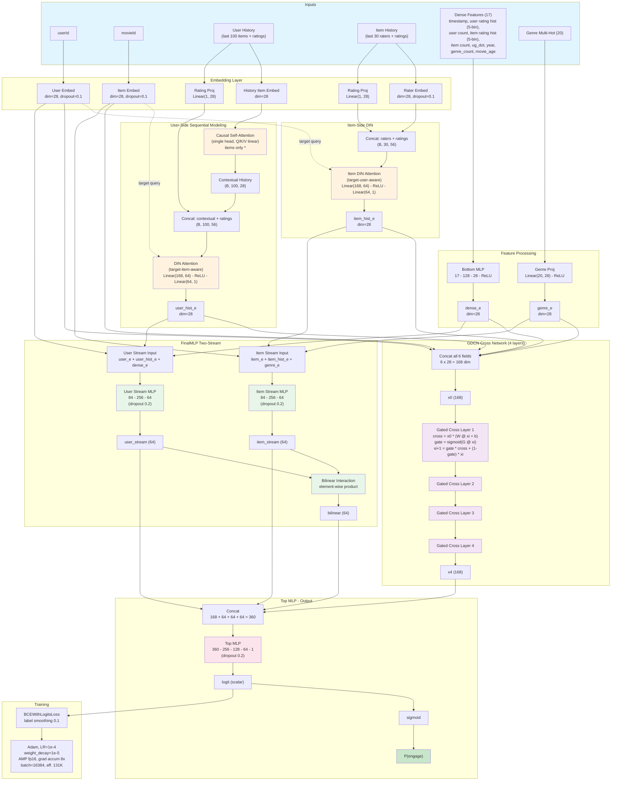

# Model Architecture

DLRM with rating-aware DIN + causal self-attention, item-side DIN, 4 GDCN cross layers, FinalMLP two-stream with bilinear.

**val_auc = 0.806 on ml-25m** | ~13M params | ~9.7 GB VRAM on NVIDIA L4 | ~140 experiments

\* **Known design note:** Causal self-attention operates on item embeddings only, then the output is concatenated with per-position rating embeddings for DIN. This means the contextual embedding at position i (a weighted mix of items 0..i) is paired with the rating specifically for item i. A residual connection or combined input was tested but gave identical AUC (0.806), suggesting the model compensates for this misalignment.
